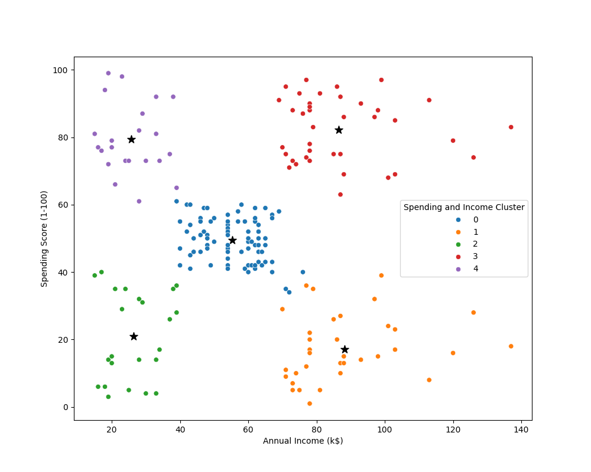

# Customer Segmentation & Clustering using KMeans Unsupervised Machine Learning Algorithm

**Tools used:** Python, Jupyter Notebook

## Problem Statement:
- Understand the Target Customers for the marketing team to plan a strategy.
- Identify the most important shopping groups based on income, age, and the mall shopping score.
- Create an ideal number of groups with a label for each.

## Objective Market Segmentation:
- Divide the mall target market into approachable groups.
- Create subsets of a market based on demographics behavorial criteria to better understand the target for marketing activities.

## Approach:
1. We will first perform EDA (Exploratory Data Analysis).
2. Then, we'll apply KMeans Clustering Algorithm to create our segments.
3. Use summary statistics on the clusters
4. Visualize the clusters

## Analysis:

- Target group would be cluster 1 which has a high spending score and  high income.
- 60 percent of cluster 1 shoppers are women.
- We should look for ways to attract these customers using a marketing campaign targeting popular items in this cluster.
- Cluster 2 presents an interesting opportunity to market to the customers for sales event on popular items.

**END OF DOCUMENT**
